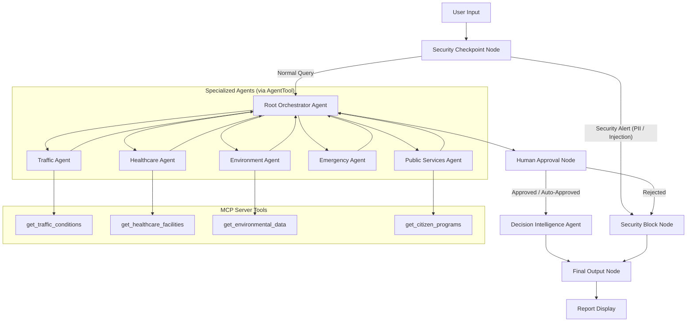

# Submission Write-Up — Smart Community Decision Intelligence Platform

## Problem Statement

Rapidly expanding urban environments generate vast amounts of disparate structured and unstructured data across traffic networks, air quality sensors, healthcare availability, weather stations, and local public services. City administrators, first responders, and citizens often struggle to parse these fragmented data streams when making critical, time-sensitive decisions. 

Whether responding to a flash flood, identifying the nearest accessible emergency room, avoiding severe congestion during an urban commute, or verifying eligibility for government support schemes, there is an urgent need for a unified, secure, and intelligent coordination layer. 

The **Smart Community Decision Intelligence Platform** solves this by providing a multi-agent AI system that safely ingests community metrics, coordinates domain-specialized analytical sub-agents, pauses for administrative oversight during emergencies, and outputs unified, actionable decision recommendations.

---

## Solution Architecture

The application is structured as an event-driven graph workflow using **ADK 2.0**.

---

## Concepts Used

This project demonstrates the core architectural components of the **Google Agent Development Kit (ADK)**:

1. **ADK 2.0 Graph Workflow**:
   Implemented in [app/agent.py](file:///d:/genai-WorkSpace/smart-community-di/app/agent.py#L333-L362) using `Workflow`, `Edge`, and `@node` decorators to map explicit execution paths, branching, and outputs.
2. **LlmAgent Sub-Agents**:
   Individual domain specialists defined in [app/agent.py](file:///d:/genai-WorkSpace/smart-community-di/app/agent.py#L93-L168) (e.g. `traffic_agent`, `healthcare_agent`, etc.) each configured with specific instructions, schemas, and tools.
3. **AgentTool Delegation**:
   The `orchestrator_agent` delegates complex queries dynamically using `AgentTool` (defined in [app/agent.py](file:///d:/genai-WorkSpace/smart-community-di/app/agent.py#L170-L191)) to leverage specialists as tools.
4. **Model Context Protocol (MCP)**:
   A dedicated [app/mcp_server.py](file:///d:/genai-WorkSpace/smart-community-di/app/mcp_server.py) built using the `FastMCP` framework, wired into the agents in [app/agent.py](file:///d:/genai-WorkSpace/smart-community-di/app/agent.py#L61-L86) via `McpToolset`.
5. **Security Checkpoint Node**:
   An explicit, deterministic function node `security_checkpoint` in [app/agent.py](file:///d:/genai-WorkSpace/smart-community-di/app/agent.py#L205-L248) that evaluates, scrubs, and filters inputs.
6. **Agents CLI**:
   Scaffolded, structured, and managed via `google-agents-cli`.

---

## Security Design

The platform incorporates multi-layered safety guardrails within the `security_checkpoint` function node:
- **PII Scrubbing**: Regex patterns detect and redact phone numbers (`phone_pattern`) and email addresses (`email_pattern`) to ensure no citizen private data is forwarded to the LLM endpoints.
- **Prompt Injection Detection**: String matching checks for known injection keywords (such as `ignore previous instructions` and `bypass security`). If detected, the workflow instantly reroutes to a non-LLM `security_block` terminal node, bypassing orchestrator execution.
- **Domain-Specific Rules**: Specific content filters block malicious prompts (e.g. `make a bomb`) and medical diagnosis requests (e.g. `diagnose disease`), enforcing Responsible AI compliance.
- **Structured Audit Logging**: Every transaction logs a structured JSON summary indicating checks performed, results, and severity levels (INFO/CRITICAL) for administrator logging.

---

## MCP Server Design

The Model Context Protocol (MCP) server runs locally in the background and exposes real-time data to sub-agents:
- `get_traffic_conditions`: Returns congestion levels, delays, detours, and transit options. Wired to `traffic_agent`.
- `get_environmental_data`: Returns Air Quality Index (AQI), weather stats, and sustainability tips. Wired to `environment_agent`.
- `get_healthcare_facilities`: Returns nearby hospital locations, wait times, and specialty services. Wired to `healthcare_agent`.
- `get_citizen_programs`: Returns eligible state programs and support schemes. Wired to `public_services_agent`.

---

## Human-in-the-Loop (HITL) Flow

Citizen and municipal security requires human verification during emergencies. The `human_approval` function node in [app/agent.py](file:///d:/genai-WorkSpace/smart-community-di/app/agent.py#L250-L278) inspects agent states for critical keywords (like `emergency`, `flash flood`, `evacuation`):
- **Auto-Approval**: If no critical hazards are flagged, the workflow continues to the decision engine immediately.
- **Pause & Consent**: If a critical safety/alert state is identified, the node uses `RequestInput` to pause execution, requesting administrative authorization (*"yes/no"*). The runner yields the request and resumes only when the administrator responds, preventing unauthorized or unsafe decisions during critical events.

---

## Demo Walkthrough

The platform has been validated with three primary demonstration scenarios:
1. **General Commute & Air Quality (General Case)**: The user asks about traveling near downtown. The orchestrator calls the traffic and environment agents, gathers live MCP sensor data (e.g., 85% congestion on Main St, AQI of 35), and the Decision Agent generates a report recommending Broad St detour and subway travel.
2. **Emergency Flash Flood (HITL Case)**: The user reports a flash flood emergency. The platform pauses and prompts the administrator for approval before outputting critical evacuation instructions and emergency contacts.
3. **Prompt Injection Attempt (Safety Case)**: A malicious input attempting to override prompt rules is scrubbed and blocked immediately at the gate.

---

## Impact / Value Statement

The Smart Community Decision Intelligence Platform bridges the gap between complex municipal sensor arrays and actionable human decisions. By offering structured, secure, and explainable multi-agent recommendations:
- **Citizens** receive real-time, personalized route adaptations and public safety alerts.
- **City Administrators** get a high-confidence dashboard-ready summary of city indicators with automated human-in-the-loop safety switches.
- **Vulnerable Groups** get instant guidance on eligible support schemes and accessible health options without privacy leaks.
